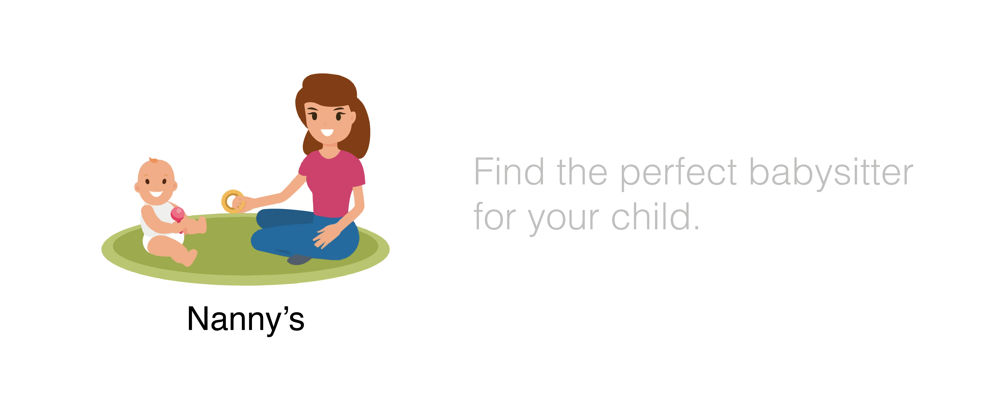

# Nanny's - Project Tech: Matching Application (Register/Login Feature)




This is the GitHub repository for my babysitter matching website feature. I decided to make the signup and login part of the website. 

## Job Story

"When I'm looking for a babysitter, I want to be able to create an account,  When I create an account, I prefer to be ready as soon as possible so that I can quickly start looking for a babysitter."

## Status

It was pretty diffucult to work with passport but at the end it worked. here is a list of future's:


*   Hashed password
*   Connection to a database to save login data when a user registered their account.
*   Different backend validation, for example to make sure that multiple users can't have the same username.

Things I might add in the future:


*   Password changing
*   Change profile
*   Add a profile picture


## Instalation
```
$   git clone https://github.com/ybouz2/project-tech.git
```
## Run

```
$   cd server
```

If you want to run Nanny's Login/register feature, and you have cloned this repo to your desktop like explained above, go to its root directory and run npm install to install its dependencies.

Now it is time to connect a database to your project. In the root you will finde the files files `index.js` and `functions.js`   This is where you establish the connection with our dev database. In order to establish the connection, you need a `.env` file in the root of your project. Your `.env` file should then (at least for the database connection) contain the following information:

```
DB_USERNAME= <- your own database username ->
DB_PASSWORD= <- your database password ->
```
Now that we've connect to the database we can start the application this is done with the following:

```
$   node index.js
```
localhost:3000 in browser

## Extentions

Refer to my [extensions](https://github.com/ybouz2/project-tech/wiki/Extensions) wiki page to find out more about the extensions i've used.

## Packages

Refer to my [packages](https://github.com/ybouz2/project-tech/wiki/Packages) wiki page to find out more about the packages i've used.

## Sources

Most of the information I got from the lesson. In addition, I also received a lot of information from student assistants and students. I also watched tutorials on the internet and looked at articles that gave me additional information:

*   [dotenv](https://www.npmjs.com/package/dotenv)
*   [handlebars](https://www.npmjs.com/package/express-handlebars)
*   [passport](https://www.npmjs.com/package/passport)
*   [mongoDB](https://www.mongodb.com/)
*   [body-parser](https://www.npmjs.com/search?q=body-parser)
*   [Webdev Turtorial](https://www.youtube.com/watch?v=-RCnNyD0L-s)


